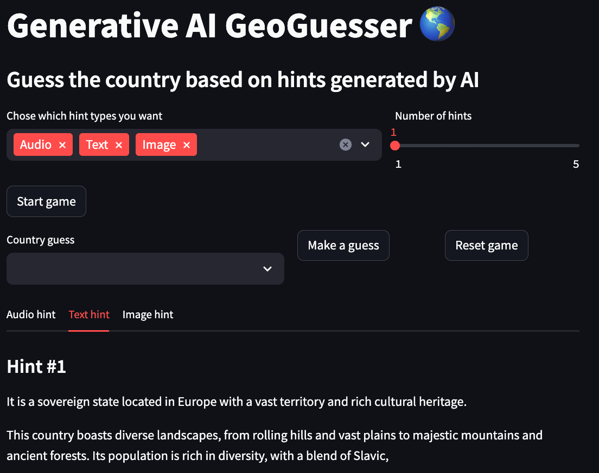
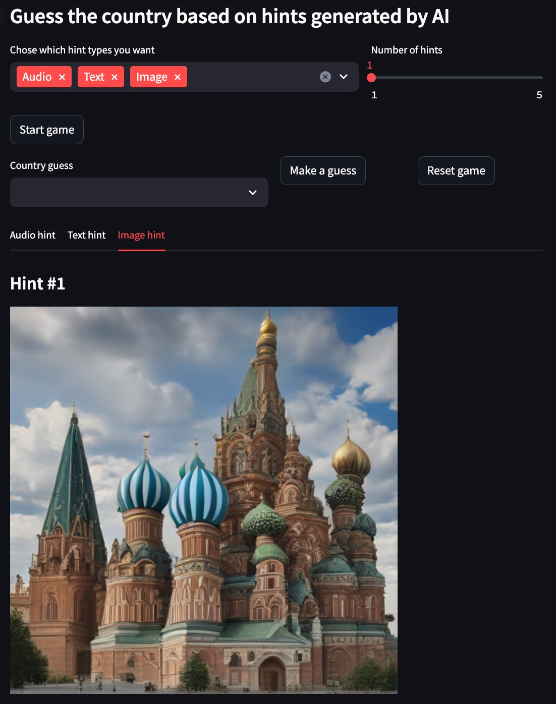
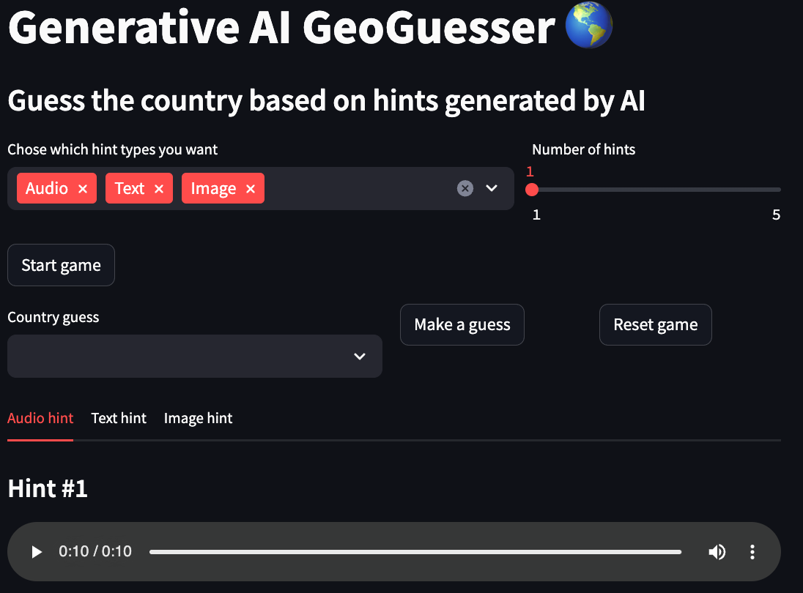

# GenAI GeoGuesser

### Guess the country name from hits generated by AI

This project is a different take on the popular [GeoGuessr](https://www.geoguessr.com) game in which you are placed on a random world location on Google Maps and have to guess the location during a time countdown. Here you will have to guess the country name based on multimodal hints generated by AI models, you can choose among 3 modalities, **text** which gives you a textual description of the country, **image** which gives you an image that resembles the country and **audio** which gives you an audio sample related to the country.

You can check an online demo of this app at its HuggingFace spaces [](https://huggingface.co/spaces/Dimitre/GenAI-GeoGuesser), this demo was limited to generate only image hints because of performance reasons.

---

#### If you wanna learna bit more about how this project works and how it was created checkout the article "[Building a generative AI-based GeoGuesser](https://dimitreoliveira.medium.com/building-a-generative-ai-based-geoguesser-95c0510d153b)".

---


# Workflow
1. Pick the hint modalities desired.
2. Choose the number of hints for each modality.
3. Click on the "Start game" button.
4. Look at all the hints and type your guess in the "Country guess" field.
5. Click on the "Make a guess" button.

# Demo

For the examples below, the chosen country is **Russia**.

### Text hint


### Image hint


### Audio hint


# Usage
The recommended approach to use this repository is with [Docker](https://docs.docker.com/), but you can also use a custom venv, just make sure to install all dependencies.

## Configs
```
local:
  to_use: true
  text:
    model_id: google/gemma-1.1-2b-it
    device: cpu
    max_output_tokens: 50
    temperature: 1
    top_p: 0.95
    top_k: 32
  image:
    model_id: stabilityai/sdxl-turbo
    device: mps
    num_inference_steps: 1
    guidance_scale: 0.0
  audio:
    model_id: cvssp/audioldm2-music
    device: cpu
    num_inference_steps: 200
    audio_length_in_s: 10
vertex:
  to_use: false
  project: {VERTEX_AI_PROJECT}
  location: {VERTEX_AI_LOCALTION}
  text:
    model_id: gemini-1.5-pro-preview-0409
    max_output_tokens: 50
    temperature: 1
    top_p: 0.95
    top_k: 32
```

- **local**
  - **to_use:** If the project should use this setup config
  - **text**
    - **model_id:** Model used to create the text hints
    - **device:** Device used by the model, usually one of (cpu, cuda, mps)
    - **max_output_tokens:** Maximum number of tokens generated by the model
    - **temperature:** Temperature controls the degree of randomness in token selection. Lower temperatures are good for prompts that expect a true or correct response, while higher temperatures can lead to more diverse or unexpected results. With a temperature of 0 the highest probability token is always selected
    - **top_p:** Top-p changes how the model selects tokens for output. Tokens are selected from most probable to least until the sum of their probabilities equals the top-p value. For example, if tokens A, B, and C have a probability of .3, .2, and .1 and the top-p value is .5, then the model will select either A or B as the next token (using temperature)
    - **top_k:** Top-k changes how the model selects tokens for output. A top-k of 1 means the selected token is the most probable among all tokens in the model’s vocabulary (also called greedy decoding), while a top-k of 3 means that the next token is selected from among the 3 most probable tokens (using temperature)
  - **image**
    - **model_id:** Model used to create the image hints
    - **device:** Device used by the model, usually one of (cpu, cuda, mps)
    - **num_inference_steps:** Number of inference steps for the model
    - **guidance_scale:** Forces the generation to better match the prompt potentially at the cost of image quality or diversity
  - **audio**
    - **model_id:** Model used to create the audio hints
    - **device:** Device used by the model, usually one of (cpu, cuda, mps)
    - **num_inference_steps:** Number of inference steps for the model
    - **audio_length_in_s:** Duration length of the audio hint
- **vertex**
  - **to_use:** If the project should use this setup config
  - **project:** Project name used by Vertex AI
  - **location:** Project location used by Vertex AI
  - **text**
    - **model_id:** Model used to create the text hints
    - **max_output_tokens:** Maximum number of tokens generated by the model
    - **temperature:** Temperature controls the degree of randomness in token selection. Lower temperatures are good for prompts that expect a true or correct response, while higher temperatures can lead to more diverse or unexpected results. With a temperature of 0 the highest probability token is always selected
    - **top_p:** Top-p changes how the model selects tokens for output. Tokens are selected from most probable to least until the sum of their probabilities equals the top-p value. For example, if tokens A, B, and C have a probability of .3, .2, and .1 and the top-p value is .5, then the model will select either A or B as the next token (using temperature)
    - **top_k:** Top-k changes how the model selects tokens for output. A top-k of 1 means the selected token is the most probable among all tokens in the model’s vocabulary (also called greedy decoding), while a top-k of 3 means that the next token is selected from among the 3 most probable tokens (using temperature)

## Commands
Start the game app.
```bash
make app
```

Build the Docker image.
```bash
make build
```

Apply lint and formatting to the code (only needed for development).
```bash
make lint
```